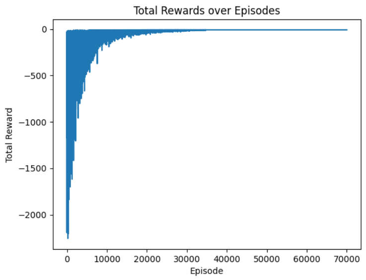

# Grid World with Portals

Custom 9x9 GridWorld environment implemented in Python with Pygame. Features an agent navigating a grid with portals that have distinct entry and exit points, aiming to reach a goal.

## Features
- 9x9 grid layout with various states.
- Dynamic portal system with distinct entry and exit points.
- Visualization using Pygame.

I created the Agent as the famous anime character, Naruto🍥 who has to reach his favourite bowl of Ichiraku Ramen🍜 in the best possible way!!

Feel free to play around and customize to your personal favourites😉
## Installation


1. Clone the repository :
    ```bash
    git clone https://github.com/yourusername/Reinforcement-Learning-using-Custom-Environment-Grid-World.git
    ```

    ```bash
    cd Reinforcement-Learning-using-Custom-Environment-Grid-World
    ```
2. Install Dependencies:
    ```bash
    pip install -r requirements.txt
    ```

or

    pip install numpy matplotlib gymnasium pygame
## Import Required Libraries

```bash
import gymnasium as gym
from gym import spaces
from gym import Env
from gym.spaces import Discrete
import numpy as np
import pickle
import matplotlib.pyplot as plt
import pygame
import time
```
## Create the GridWorld Class

A customizable grid-based environment where an agent navigates through cells, encountering obstacles and portals. It supports state transitions, rewards, and basic actions like moving up, down, left, and right.

### Steps to create the class:

Step-1: Initialize the class and create the __init__() function:

```bash
    class GridWorld(object):
        def __init__(self, m, n, magicSquares, startPosition=0):
            self.grid = np.zeros((m, n))
            self.m = m
            self.n = n
            self.stateSpace = [i for i in range(self.m * self.n)]
            self.stateSpace.remove(80)  # Ensure this is correct for   your use case
            self.stateSpacePlus = [i for i in range(self.m * self.n)]
            self.actionSpace = {
                'U': -self.n,
                'D': self.n,
                'L': -1,
                'R': 1
            }
            self.possibleActions = ['U', 'D', 'L', 'R']
            self.addMagicSquares(magicSquares)
            self.agentPosition = startPosition
```

Step-2: Define the Terminal States:

```bash
    def isTerminalState(self, state):
        return state in self.stateSpacePlus and state not in self.stateSpace
```

Step-3: Add the Magic Squares:

_Magic Squares_ are the portals where the agent can travel across the grid in 0 reward.

```bash
    def addMagicSquares(self, magicSquares):
        self.magicSquares = magicSquares
        i = 2  # Start labeling with 2 for magic squares
        for start_square, end_square in self.magicSquares.items():
            x_start = start_square // self.n
            y_start = start_square % self.n
            self.grid[x_start][y_start] = i
            i += 1
            x_end = end_square // self.n
            y_end = end_square % self.n
            self.grid[x_end][y_end] = i
            i += 1
```

Step-4: Determine the current position of the Agent:

```bash
    def getAgentRowAndColumn(self):
        x = self.agentPosition // self.n
        y = self.agentPosition % self.n
        return x, y
```

Step-5: Set the state of the Grid using the position of the Agent as acquired from before.

```bash
    def setState(self, state):
        x, y = self.getAgentRowAndColumn()
        self.grid[x][y] = 0
        self.agentPosition = state
        x, y = self.getAgentRowAndColumn()
        self.grid[x][y] = 1
```

Step-6: Check if the move is possible and our Agent does not move off limits:

```bash
    def offGridMove(self, newState, oldState):
        if newState not in self.stateSpacePlus:
            return True
        elif oldState % self.n == 0 and newState % self.n == self.n - 1:
            return True
        elif oldState % self.n == self.n - 1 and newState % self.n == 0:
            return True
        else:
            return False
```

Step-6: Define the __step__ function:

The _step_ function is used to update the agent's position based on the action taken. It also checks for portal usage, calculates the reward and tells whether the episode has ended.

```bash
    def step(self, action):
        resultingState = self.agentPosition + self.actionSpace[action]
        if resultingState in self.magicSquares:
            resultingState = self.magicSquares[resultingState]
    
        reward = -1 if not self.isTerminalState(resultingState) else 0
        if not self.offGridMove(resultingState, self.agentPosition):
            self.setState(resultingState)
            return resultingState, reward, self.isTerminalState(resultingState), None
        else:
            return self.agentPosition, reward, self.isTerminalState(self.agentPosition), None
```

Step-7: Define the __reset__ function:

The _reset_ function is used to reset the environment after every episode.

```bash
    def reset(self):
        self.agentPosition = 0
        self.grid = np.zeros((self.m, self.n))
        self.addMagicSquares(self.magicSquares)
        return self.agentPosition
```

Step-8: Define the __render__ function:

The _render_ function is used to get the state of the environment at a particular instant.

```bash
    def render(self):
        print('**************************************************')
        for row in self.grid:
            for col in row:
                if col == 0:
                    print('-', end='\t')
                elif col == 1:
                    print('P', end='\t')
                elif col == 2:
                    print('Ain', end='\t')
                elif col == 3:
                    print('Aout', end='\t')
                elif col == 4:
                    print('Bin', end='\t')
                elif col == 5:
                    print('Bout', end='\t')
            print('\n')
        print('**************************************************')
```

You can change the delemiters from __'*'__ to anything of your choice.


Step-9: Get a random action from the Action Space:

```bash
    def actionSpaceSample(self):
        return np.random.choice(self.possibleActions)
```
## Create the Custom Environment for the Grid World Class

This is a custom environment that wraps the GridWorld class, enabling visual interaction and rendering using Pygame. It facilitates training reinforcement learning models with a customizable and visually rich grid world.

### Steps to create the Custom Environment:

Step-1:  Initialize the class and create the __init__() function:

```bash
class GridWorldEnv(Env):
    metadata = {'render.modes': ['human']}

    def __init__(self, gridWorld, portal_1_entry_img_path, portal_1_exit_img_path, portal_2_entry_img_path, portal_2_exit_img_path, player_img_path, destination_img_path):
        super(GridWorldEnv, self).__init__()
        self.gridWorld = gridWorld
        self.cell_size = 64  # Set the cell size to match the image size
        self.width = self.gridWorld.n * self.cell_size
        self.height = self.gridWorld.m * self.cell_size
        self.action_space = Discrete(len(self.gridWorld.possibleActions))
        self.observation_space = Discrete(self.gridWorld.m * self.gridWorld.n)

        # Initialize Pygame for graphical rendering
        self.screen = None

        # Load images
        self.portal_1_entry_img = pygame.image.load(portal_1_entry_img_path)
        self.portal_1_entry_img = pygame.transform.scale(self.portal_1_entry_img, (self.cell_size, self.cell_size))
        self.portal_1_exit_img = pygame.image.load(portal_1_exit_img_path)
        self.portal_1_exit_img = pygame.transform.scale(self.portal_1_exit_img, (self.cell_size, self.cell_size))
        self.portal_2_entry_img = pygame.image.load(portal_2_entry_img_path)
        self.portal_2_entry_img = pygame.transform.scale(self.portal_2_entry_img, (self.cell_size, self.cell_size))
        self.portal_2_exit_img = pygame.image.load(portal_2_exit_img_path)
        self.portal_2_exit_img = pygame.transform.scale(self.portal_2_exit_img, (self.cell_size, self.cell_size))
        self.player_img = pygame.image.load(player_img_path)
        self.player_img = pygame.transform.scale(self.player_img, (self.cell_size, self.cell_size))
        self.destination_img = pygame.image.load(destination_img_path)
        self.destination_img = pygame.transform.scale(self.destination_img, (self.cell_size, self.cell_size))

        # Determine the destination cell based on the final position (e.g., bottom-right corner)
        self.destination_cell = (self.gridWorld.m - 1, self.gridWorld.n - 1)  # Last cell

        # Store portal positions for rendering
        self.portal_positions = {
            'portal_1_entry': set(),
            'portal_1_exit': set(),
            'portal_2_entry': set(),
            'portal_2_exit': set()
        }
        
        for start, end in self.gridWorld.magicSquares.items():
            if end in self.gridWorld.magicSquares:
                self.portal_positions['portal_1_entry'].add(start)
                self.portal_positions['portal_1_exit'].add(end)
            else:
                self.portal_positions['portal_2_entry'].add(start)
                self.portal_positions['portal_2_exit'].add(end)
```

You can have multiple images for different entries and exits in the portals. However, I have kept it at a single pic each.

Step-2: Define the __reset__ function:

This function accesses the _reset_ function from the __GridWorld__ class.

```bash
    def reset(self):
        return self.gridWorld.reset()
```

Step-3: Define the __set__ function:

This function accesses the _step_ function from the __GridWorld__ class and returns the _state_, _reward_, and _done_ attributes based on a particular action from the Action Space.

```bash
    def step(self, action_index):
        # Map action index to action string
        action = self.gridWorld.possibleActions[action_index]
        state, reward, done, _ = self.gridWorld.step(action)
        return state, reward, done, {}
```

Step-4: Define the __render__ function:

This function builds on the _render_ function from the __GridWorld__ class and renders a _PyGame_ screen with the desired grid and images for _Portals_, _Final destination_, and the _Agent_. This is only done if the _render_mode_ set to __"human"__.

```bash
    def render(self, mode='human'):
        if self.screen is None:
            pygame.init()
            self.screen = pygame.display.set_mode((self.width, self.height))
        
        self.screen.fill((255, 255, 255))  # Fill screen with white

        for i in range(self.gridWorld.m):
            for j in range(self.gridWorld.n):
                cell_value = self.gridWorld.grid[i, j]
                rect = pygame.Rect(j * self.cell_size, i * self.cell_size, self.cell_size, self.cell_size)
                pygame.draw.rect(self.screen, (255, 255, 255), rect)
                pygame.draw.rect(self.screen, (0, 0, 0), rect, 1)  # Draw grid lines

                cell_index = i * self.gridWorld.n + j

                # Draw images based on the cell value and portal positions
                if (i, j) == self.destination_cell:
                    self.screen.blit(self.destination_img, rect.topleft)
                elif cell_index in self.portal_positions['portal_1_entry']:
                    self.screen.blit(self.portal_1_entry_img, rect.topleft)
                elif cell_index in self.portal_positions['portal_1_exit']:
                    self.screen.blit(self.portal_1_exit_img, rect.topleft)
                elif cell_index in self.portal_positions['portal_2_entry']:
                    self.screen.blit(self.portal_2_entry_img, rect.topleft)
                elif cell_index in self.portal_positions['portal_2_exit']:
                    self.screen.blit(self.portal_2_exit_img, rect.topleft)
                elif cell_value == 1:  # Player
                    self.screen.blit(self.player_img, rect.topleft)

        pygame.display.flip()
```

Step-5: Define the __close__ function:

This function closes the _PyGame_ screen after the execution of code is complete.

```bash
    def close(self):
        if self.screen is not None:
            pygame.quit()
            self.screen = None
```
## Define the Paths for Images

```bash
portal_1_entry = 'path_to_portal_1_entry_img'
portal_1_exit = 'path_to_portal_1_exit_img'
portal_2_entry = 'path_to_portal_2_entry_img'
portal_2_exit = 'path_to_portal_2_exit_img'
player_path = 'path_to_player_img'
dest_path = 'path_to_destination_img'
```

For code clarity, try to keep all images in __.png__ format and of the same size _(64*64 pixels)_.

Else you can always edit and make it truly yours😉
## Run Your Custom Environment before starting Training

This is an optional step. This should be done only to make sure your environment if working fine.

```bash
grid_world = GridWorld(9, 9, {20:54, 63:9})
env = GridWorldEnv(grid_world, portal_1_entry, portal_1_exit, portal_2_entry, portal_2_exit, player_path, dest_path)
state = env.reset()
done = False

while not done:
    env.render()
    action = env.action_space.sample()
    state, reward, done, _ = env.step(action)
    time.sleep(0.5)

env.close()
```
## Create the Max Action function

The __Max Action__ function is used to select the action that maximizes the expected reward for a given state by evaluating the Q-values of all possible actions. It further returns the action corresponding to the highest Q-value, guiding the agent's decision-making process.

```bash
def maxAction(Q, state, actions):
    values = np.array([Q[state, action] for action in actions])
    action = actions[np.argmax(values)]
    return action
```
## Defining Hyper Parameters

Here, we define the hyper-parameters for the model.

In particualr, we will be defining:
- Learning Rate _(alpha)_
- Discount Factor _(gamma)_
- Epsilon
- Number of games to be played for Training

```bash
ALPHA = 0.1  # Learning Rate
GAMMA = 1.0  # Discount Factor
EPS = 1.0    # Epsilon
num_games = 70000
```

Feel free to play around with these values to get the best results!
## Initialize Environment and Q-table

In this section, we will initialize the environment and define the positions of our _Magic Squares_ on the board.

I will be working on a 9x9 grid for this example, with the following magic squares:
- Entry : 18, Exit : 48
- Entry : 63, Exit : 7
As clearly evident, the first magic square takes the agent near its destination, while the second one takes it farther away.

```bash
magicSquares = {18: 48, 63: 7}
grid_world = GridWorld(9, 9, magicSquares)
env = GridWorldEnv(grid_world, portal_1_entry, portal_1_exit, portal_2_entry, portal_2_exit, player_path, dest_path)

Q = {}
for state in env.gridWorld.stateSpacePlus:
    for action in env.gridWorld.possibleActions:
        Q[state, action] = 0
```

Feel free to play around with these values as well!!
## Define the Training Loop

I trained my setup for 70,000 episodes and saved the observations in the Q-table.

I also placed a flag that indicates an episode for every 5,000 episodes, so as to keep track while training.

This is the training loop:

```bash
for i in range(num_games):
    if i % 5000 == 0:
        print(f'Starting game : {i}')
    done = False
    epRewards = 0
    observation = env.reset()
    while not done:
        rand = np.random.random()
        action = maxAction(Q, observation, env.gridWorld.possibleActions) if rand < (1 - EPS) else env.gridWorld.actionSpaceSample()
        action_index = env.gridWorld.possibleActions.index(action)
        observation_, reward, done, _ = env.step(action_index)
        epRewards += reward
        action_ = maxAction(Q, observation_, env.gridWorld.possibleActions)
        action_index_ = env.gridWorld.possibleActions.index(action_)
        
        # Use get method to handle missing keys
        Q[observation, action] = Q.get((observation, action), 0) + ALPHA * (reward + GAMMA * Q.get((observation_, action_), 0) - Q.get((observation, action), 0))
        observation = observation_

    if EPS - 2 / num_games > 0:
        EPS -= 2 / num_games
    else:
        EPS = 0  
```
## Save the Trained Q-Table

The updated Q-table is saved for further uses.

```bash
with open('q_table_1.pkl', 'wb') as f:
    pickle.dump(Q, f)
print("Training complete and Q-table saved.")
```
## Load the Q-table to visualize the learnings in the Environment

### Load the Trained Q-table

```bash
with open('q_table_1.pkl', 'rb') as f:
    Q = pickle.load(f)
```

### Define a loop for 4 more Episodes

```bash
for episode in range(4):
    done = False
    observation = env.reset()
    while not done:
        env.render()  # Show the environment
        action = maxAction(Q, observation, env.gridWorld.possibleActions)
        action_index = env.gridWorld.possibleActions.index(action)
        observation, _, done, _ = env.step(action_index)
        pygame.time.delay(500)  # Delay to visualize

env.close()
```

## Plotting the Results

Finally, it is time to see how our model perform over the 70,000 episodes. To do so, just type the following:

```bash
plt.plot(totalRewards)
plt.xlabel('Episode')
plt.ylabel('Total Reward')
plt.title('Total Rewards over Episodes')
plt.show()
```

The final results should be something like:



## Final Words...

Reinforcement Learning is a really intresting field for a lot of Research and other domains including Robotics, Games, and others.

I hope this was a good way for you to get the know-how of creating your own custom environment for RL, which can facilitate a lot of works in the future.

Stay tuned for other intresting things, see ya👋🏼!!
